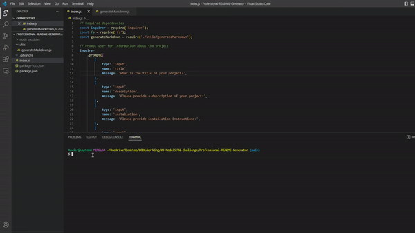

# Professional README Generator

## Description

This is a Node.js-based tool where users can quickly and easily generate README.md files for their projects.

## Installation

1. Clone the Git repository and then navigate to the folder.
2. "npm init"
3. "npm install --save inquirer@^8.0.0
4. Application is run with "node index.js"

## Usage

The user will answer a series of questions in the command line to generate README.md.

### Walkthrough:

### Links:

Walkthrough video: https://gifyu.com/image/Sq0Nd
https://github.com/XvrTeo/Professional-README-Generator
